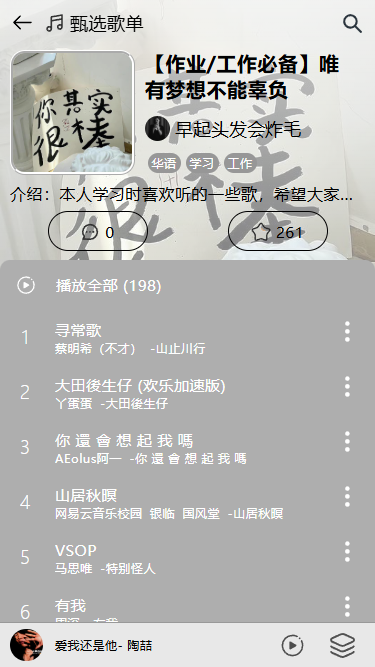
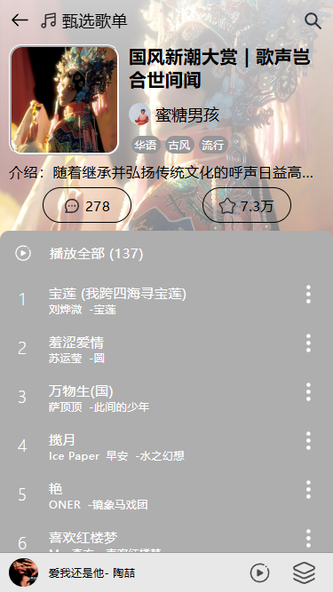
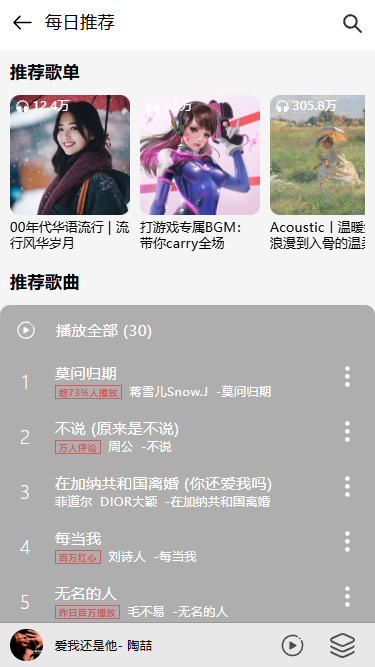
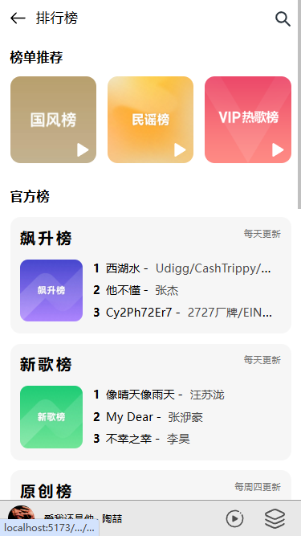
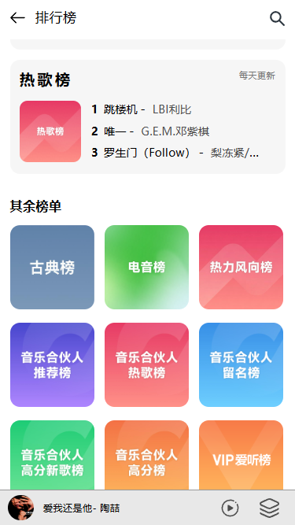
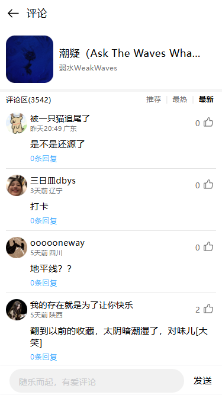
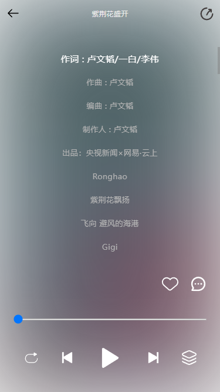
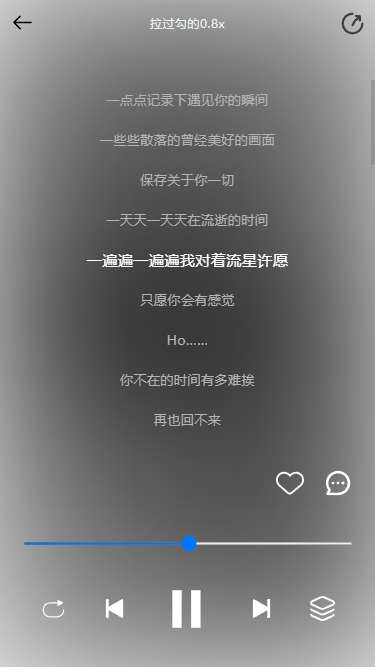

# vue3-music-cdm

## 介绍

该项目是基于Vue3和Vant组件库实现的一个移动端音乐网站，样式大多借鉴于网易云音乐移动端

## 技术栈

前端： Vue3 + Vant + Vue-Router + Axios + Less + Pinia + Eslint + Prettier + Vite
后端： [网易云音乐 NodeJS 版 API](https://binaryify.github.io/NeteaseCloudMusicApi/#/)提供的API
(ps:后端API因版权原因有可能已经无法获取)

## 项目安装

```sh
//克隆该项目
git clone https://github.com/cdm1110/music-vue.git
```

## 功能效果图预览展示
#### 1.首页


#### 2.歌单
|  |  |
|:-|:-|

#### 3.每日推荐和排行榜
 |  | 
|:-|:-|:-|

#### 4.歌单和歌词的评论页
|  |  |
|:-|:-|

#### 5.播放页和歌词页
|  |  | |  |  |
|:-|:-|:-|:-|

## 项目页面功能完成列表

✅  首页

⬜️  登录/退出登录

✅  排行榜

✅  歌单列表页

✅  歌单列表页

✅  每日推荐

✅  各类排行榜

✅  歌曲播放

✅  播放条

✅  底部播放栏

✅  歌单歌词评论展示

⬜️  评论留言点赞删除等

⬜️  搜索页面

⬜️  歌曲收藏

⬜️  个人主页

⬜️  私人FM

⬜️  侧边菜单

......
